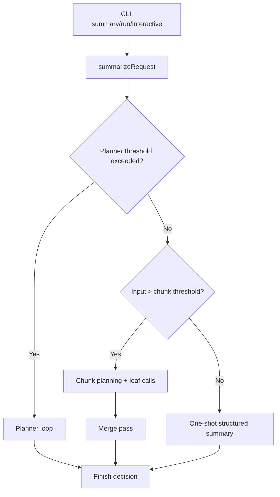
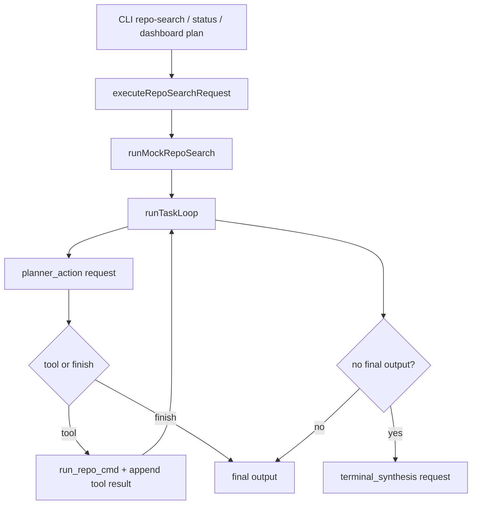

# Prompt Dispatch, Splitting, and Structure Inventory (Public API)

This document inventories all **public** paths in SiftKit that can send prompts to `llama.cpp`, how they are structured, when they split, and what fallback logic can change behavior.

## 1. Public Flow Catalog

| Flow ID | Public entrypoint(s) | Main code path | Llama send mode(s) |
|---|---|---|---|
| F1 | `siftkit summary ...` | `src/cli.ts` -> `summarizeRequest` | One-shot summary, planner loop, chunked leaf+merge |
| F2 | `siftkit run ...` and internal `command-analyze` | `src/command.ts` -> `analyzeCommandOutput` -> `summarizeRequest` | Same as F1, but `sourceKind=command-output` |
| F3 | Internal `interactive-capture` (exposed by status/internal ops) | `src/interactive.ts` -> `summarizeRequest` | Same as F1, but transcript-driven `command-output` |
| F4 | `siftkit repo-search ...` and status `/repo-search` and dashboard plan/repo-search endpoints | `src/repo-search.ts` -> `scripts/mock-repo-search-loop.js` | Multi-turn planner chat loop with tool calls; optional streaming planner request |
| F5 | Direct bridge utility (`llama-cpp-bridge generate`) | `src/llama-cpp-bridge.ts` -> `generateLlamaCppResponse` | Direct single prompt wrapper (no splitting/planner) |
| F6 | Dashboard chat POST `/dashboard/chat/sessions/:id/messages` | `siftKitStatus/index.js` -> `generateChatAssistantMessage` | Stateful chat completion (non-stream) |
| F7 | Dashboard chat streaming POST `/dashboard/chat/sessions/:id/messages/stream` | `siftKitStatus/index.js` -> `streamChatAssistantMessage` | Stateful chat completion (stream=true SSE) |

Notes:
- F1/F2/F3 share one core engine in `src/summary.ts`.
- F4 is public even though executor lives in `scripts/mock-repo-search-loop.js` because status server calls it for CLI and dashboard plan/repo-search.

## 2. Send/Split Modes

### Mode A: One-shot structured summary (F1/F2/F3/F5)
- Prompt built by `buildPrompt(...)` (summary pipeline) or direct prompt text (bridge).
- Sent as `/v1/chat/completions` with `messages=[{ role:"user", content: prompt }]`.
- Summary path enforces decision grammar (`siftkit-decision-json`) unless mock backend.

### Mode B: Planner chat loop with tools (F1/F2/F3 planner branch; F4 planner loop)
- Uses chat transcript messages and tool call round-trips.
- Summary planner tools: `find_text`, `read_lines`, `json_filter`.
- Repo-search planner tool: `run_repo_cmd`.
- Enforces planner action grammar (`siftkit-planner-action-json` in summary planner; dedicated grammar in repo-search loop).

### Mode C: Chunked leaf passes + merge pass (F1/F2/F3)
- Oversize input can split into chunks.
- Each chunk is summarized as a structured decision.
- Decisions are merged by a final `phase="merge"` prompt.

### Mode D: Token-aware chunk planning vs fixed split fallback (F1/F2/F3)
- For llama backend, token-aware planning attempts to fit prompt budget (`planTokenAwareLlamaCppChunks`).
- Falls back to character chunking if tokenization unavailable or planner fails.

### Mode E: Retry-on-oversize reduction (F1/F2/F3)
- On llama HTTP 400 prompt failure, summary retries with a reduced chunk threshold.

## 3. Prompt Structures and Constraints

## 3.1 Summary prompt template (`buildPrompt`)
- Major sections:
  - `Rules`
  - `Classification schema`
  - `Response JSON shape`
  - `Source handling`
  - `Profile`
  - `Output requirements`
  - `Risk handling`
  - `Question`
  - `Input`
- Output schema:
  - `{"classification":"summary|command_failure|unsupported_input","raw_review_required":true|false,"output":"..."}`
  - `unsupported_input` can be disallowed in some contexts.

## 3.2 Chunk-slice literal wrapper mode
- For generated chunks, prompt includes:
  - `<<<BEGIN_LITERAL_INPUT_SLICE>>>`
  - `<<<END_LITERAL_INPUT_SLICE>>>`
- Adds strict instructions to avoid returning `unsupported_input` just because a slice is partial/truncated.

## 3.3 Summary planner prompts
- System prompt defines planner behavior, tool use, and finish action shape.
- Initial user prompt includes a document profile + question.
- Invalid planner replies get a corrective retry prompt.

## 3.4 Repo-search planner prompts
- System prompt (`buildTaskSystemPrompt`) enforces one JSON action per turn, read-only command policy, and minimum search depth.
- Initial user prompt is task-only.

## 3.5 Dashboard chat prompts
- System seed: `general, coder friendly assistant`.
- Optional second system message with hidden tool context from prior plan/repo-search messages.
- Then chat history (user/assistant visible messages) + latest user input.

## 4. HTTP Payload Variants to llama.cpp

All send to `/v1/chat/completions`.

### 4.1 Messages only
- Summary one-shot and bridge path use user-only message payload.

### 4.2 With tools + grammar
- Summary planner:
  - `tools` with `find_text/read_lines/json_filter`
  - `extra_body.grammar` for planner action JSON
- Repo-search planner:
  - `tools` with `run_repo_cmd`
  - `extra_body.grammar` for planner action JSON

### 4.3 Reasoning/thinking controls
- Summary one-shot can force non-thinking (`reasoningOverride='off'`) for small top-level inputs.
- Summary/chat/repo-search use `chat_template_kwargs.enable_thinking`.
- When disabled, request includes `extra_body.reasoning_budget=0`.

### 4.4 Sampling and generation knobs
- Common knobs can include:
  - `temperature`, `top_p`, `max_tokens`
  - `extra_body.top_k`, `extra_body.min_p`
  - `extra_body.presence_penalty`, `extra_body.repeat_penalty`

### 4.5 Slot and cache routing
- Summary/repo-search can send `id_slot`.
- Requests typically set `cache_prompt: true`.

### 4.6 Streaming variants
- Repo-search planner uses stream mode when progress callback is enabled.
- Dashboard chat streaming endpoint uses `stream: true`.

## 5. Split/Threshold/Budget Triggers

## 5.1 Planner activation (summary pipeline)
- Activation threshold:
  - `floor(numCtx * inputCharsPerToken * 0.75)`
- Planner runs when top-level llama leaf input is above that threshold and planner budget exists.

## 5.2 Chunk threshold
- Base threshold from config (`getChunkThresholdCharacters`).
- Llama-adjusted threshold subtracts reserve:
  - reserve tokens = `10,000` (reasoning off) or `15,000` (reasoning on/auto)
  - reserve chars = reserve tokens * effective chars/token

## 5.3 Preflight token recursion
- Summary builds prompt, tokenizes via `/tokenize`, and may recursively reduce chunk threshold before first completion call.

## 5.4 Planner headroom stop-line
- Usable prompt budget:
  - `usable = numCtx - reserveTokens`
- Headroom:
  - `max(ceil(usable * 0.15), 4000)`
- Stop-line:
  - `usable - headroom`
- Planner aborts if transcript prompt token count exceeds stop-line.

## 5.5 Tool-result token guard
- Summary planner: replaces tool result with stub if result tokens exceed 70% of remaining stop-line budget.
- Repo-search planner: per-tool cap and remaining allowance guards can replace inserted tool result with a token-budget error line.

## 5.6 Retry/fallback branches
- If llama returns HTTP 400 in summary pass, retry with smaller chunks.
- If structured parse fails but recoverable fields exist, attempt recovery.
- If chunk returns `unsupported_input`, retry in stricter chunk mode, then conservative local fallback.
- Command-output source avoids surfacing `unsupported_input` for non-empty input by fallback logic.

## 6. Flow Diagrams

## 7. Validation Checklist (Executed)

## 7.1 Scenario matrix

| Scenario ID | Expected behavior | Validation test(s) | Result |
|---|---|---|---|
| V1 | Summary below planner threshold -> one-shot + non-thinking override path | `tests/runtime.test.js`: `summary below planner threshold runs one-shot with forced non-thinking` | Pass (observed in runtime run output) |
| V2 | Summary above planner threshold -> planner mode | `tests/runtime.test.js`: `summary above planner threshold uses planner flow without forced non-thinking override` | Pass (observed in runtime run output) |
| V3 | Oversized input -> chunk planning/retry/merge behaviors | `tests/runtime.test.js`: `summary retries with smaller chunks...`; `summary resizes llama.cpp chunks before the first chat request...` | Pass |
| V4 | Command-output classification constraint for unsupported input | `tests/runtime.test.js`: `command-output never surfaces unsupported_input for non-empty input` | Pass |
| V5 | Repo-search planner payload shape + public endpoint path | `tests/mock-repo-search-loop.test.js`: `runTaskLoop sends append-only chat requests with explicit cache_prompt and a pinned slot`; `tests/repo-search-cli.test.js`: `repo-search delegates execution to status server` | Pass |
| V6 | Dashboard chat public path sends chat completion with hidden context handling | `tests/dashboard-status-server.test.js`: `chat completion receives hidden tool context while keeping it out of visible chat history` | Pass |

## 7.2 Command output summary
- Focused repo-search and dashboard tests passed.
- Runtime test invocation in this environment runs broad file coverage despite `--test-name-pattern`; target scenarios above still passed in the output.
- Some unrelated runtime tests failed due environment-level `EPERM` cleanup under temp paths; these are not prompt-dispatch logic regressions.

## 8. Public API Addendum

- Public API inventory here includes CLI and status-server-backed dashboard endpoints because those are externally callable operational surfaces.
- Test-only synthetic flows are excluded as primary flows, but tests were used to validate the runtime behavior listed above.
